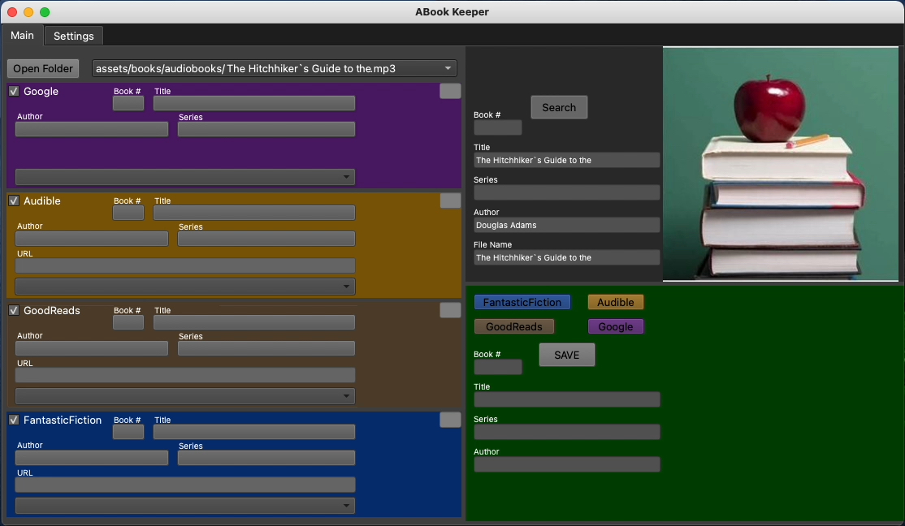
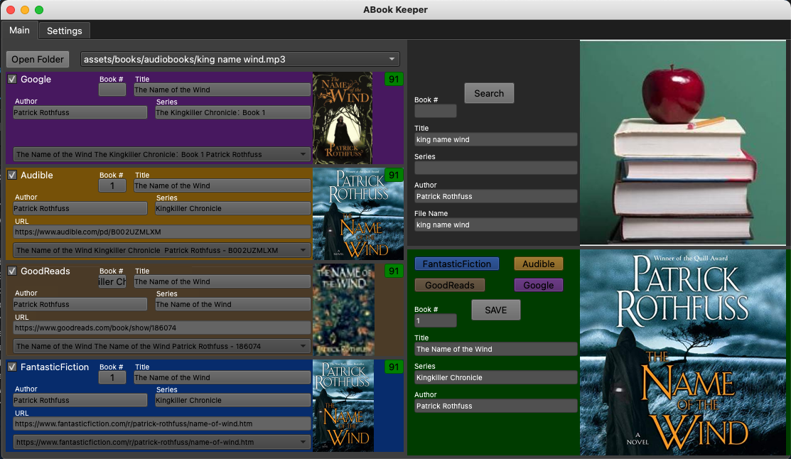
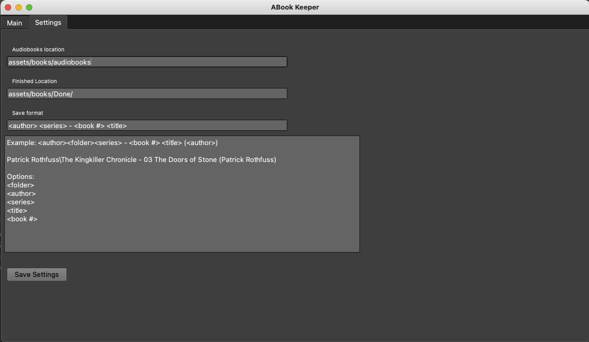

# Abook Keeper
> Description: Python desktop app to update and organizer digital audiobooks. Search across multiple website grabbing the required
> information to update the audiobook to the users specification. 
> 
Technologies: Python, Google Books API, Google Custom Search API, BeautifulSou Website Scrapper tool, SQLite, and EyeD3 a ID3 editor. 

# Creator
* Mike Treml  <a href="https://linkedin.com/in/miketreml" rel="nofollow" alt="LinkedIn" >LinkedIn</a>

